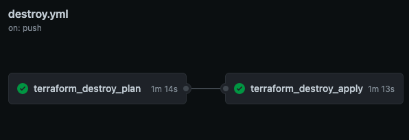

# Pathways Dojo Infra Node Weather App Quick Starter

This repository is used in conjunction with the Contino Infra Engineer to Cloud Engineer Pathway course delivered in Contini-U.

It includes and supports the following functionality:
* Dockerfile and docker-compose configuration for 3M based deployments
* Makefile providing basic Terraform deployment functionality
* GitHub workflows for supporting basic Terraform deploy and destroy functionality
* Terraform IaC for the test deployment of an s3 bucket
* Node Weather App - https://github.com/phattp/nodejs-weather-app

<br> 

## Getting Started
This GitHub template should be used to create your own repository. Repository will need to be public if you are creating it in your personal GitHub account in order to support approval gates in GitHub actions. Configure the following to get started:
* Clone your repository locally. It should have a branch named `master`.
* Create a `destroy` branch in your GitHub repo. This will be used to trigger Terraform Destroy workflow during pull request from `master->destroy`.
* Create an environment in your repository named `approval` to support GitHub Workflows, selecting `required reviewers` and adding yourself as an approver.
* Update the `key` value in the `meta.tf` file replacing `<username>` with your username for the name of the Terraform state file.
* Update the default bucket name in the `variable.tf` file to a something globally unique.
* Create GitHub Secrets in your repository for `AWS_ACCESS_KEY_ID`, `AWS_SECRET_ACCESS_KEY` and `AWS_SESSION_TOKEN` if using temporary credentials.
* Push local changes to the GitHub repos master branch, which should trigger the Github deploy workflow, and deploy the s3 bucket. Remember to review tf plan and approve apply.
* Create a pull request to merge master changes to destroy branch. Merge changes to trigger the Github destroy workflow deleting the s3 bucket. Remember to review the tf speculative plan and approve destroy.
* You can list s3 bucket in the APAC Dev account by running `make list_bucket` locally within the repo clone, to check bucket creation and removal.


Keep reading for in-depth details.

<br> 

## 3 Musketeers

The provided `makefile`, `dockerfile` , and `docker-compose.yml` files work together to create a docker container which is used to run Terraform deployments and other supported commands. It expects AWS account credentials to be passed as environment variables.

To run a simple aws command, ensure you have set your aws temporary credentials in your local environment and run the following

```
make list_bucket
```

Deploying Terraform environment locally - creates tfplan file during plan as input to apply. Apply is auto-approved.

```
make run_plan
make run_apply
```

Destroying Terraform environment locally. Destroy plan is speculative. Destroy apply is auto-approved.

```
make run_destroy_plan
make run_destroy_apply
```
Terraform `init`, `validate` and `fmt` are run for each of the `make` commands above.

For more information on 3 Musketeers deployment method, visit the official site here. https://3musketeers.io/

<br> 

## GitHub Actions / Workflows
The following workflows are provided in this repository. These are located under `.github/workflows`.

| Workflow | Description | Environments | Trigger
|----------|-------------|--------------|--------|
| main.yml | Two step workflow to run a Terraform Plan and Terraform Apply following manual approvals. | approval | on.push.branch [master] ||
| destroy.yml | Two step workflow to run a speculative Terraform Destroy Plan and Terraform Destroy following manual approvals. | approval | on.push.branch [destroy] ||

Note: Pushing to `master` branch will trigger Terraform (TF) deploy. You will also need to create a branch named `destroy` in your GitHub repository. Not required locally and only used for pull requests `master -> destroy` to trigger TF destroy workflow.

Additionally, ONLY changes to the following files and paths will trigger a workflow.

```
    paths:
      - 'docker-compose.yml'
      - 'Makefile'
      - '.github/workflows/**'
      - '*dockerfile'
      - 'modules/**'
      - '**.tf'
```

<br>

### main.yml workflow


<br>

### destroy.yml workflow


<br>

Create an environment in your repository named `approval` to support GitHub Workflows, selecting `required reviewers` adding yourself as an approver.

<br> 


<br> 

## GitHub Secrets
Create GitHub Secrets in your repository for `AWS_ACCESS_KEY_ID`, `AWS_SECRET_ACCESS_KEY` and `AWS_SESSION_TOKEN` if using temporary credentials. ONLY `AWS_ACCESS_KEY_ID` and `AWS_SECRET_ACCESS_KEY` required if you have configured an IAM user with programmatic access.

<br>

## Terraform IaC
The base Terraform environment has been setup to get you started. This includes `providers.tf`, `meta.tf`, `variables.tf` and `main.tf` which leverages the `s3.tf` module created in `modules/s3`. 

The `modules` folder allows you to organise your `.tf` files are called by `main.tf`.

### Inputs
---
<details open>
  <summary>Click to expand</summary>


| name | Description | Type | Default | Required |
|------|-------------|:----:|:-----:|:-----:|
| bucket | S3 bucket name - must be globally unique | string | my-tf-test-bucket7717 | yes |
| tags | Tags to be applied to AWS resources| map(string) | `null` | no |


</details>

<br> 

<!-- OUTPUTS -->
### Outputs
---
<details open>
  <summary>Click to expand</summary>

| name | Description |
|------|-------------|
| bucket_name | The name of the S3 Bucket. | |
| bucket_name_arn | The ARN of the S3 Bucket. | |


</details>

<br>

### TF State Files
AWS S3 is used to host the TF state files. This is hosted by s3://pathways-dojo. You will need to update the name of the state file in the `meta.tf` file replacing `<username>` with your username.

```
terraform {
  required_version = ">= 0.13.0"
  backend "s3" {
    bucket = "pathways-dojo"
    key    = <username>-tfstate
    region = "ap-southeast-2"
  }
}
```

## Node Weather App

The simple weather forecast application using Node.js.
Link: https://github.com/phattp/nodejs-weather-app

### Getting Started

This repository is contain code of my weather forecast application that you can predict the weather from a location.
This project is the part of [The Complete Node.js Developer Course](https://www.udemy.com/the-complete-nodejs-developer-course-2/) by Andrew Mead on Udemy.

Visit [Live Site](https://phatt-weather-app.herokuapp.com/)

### Installing

Install node modules.

```
npm install
```

### Running the App

Run this app in devlopment mode with command below and navigate to http://localhost:3000 to see the app.

```
npm run dev
```

Happy Hacking!
# weatherapp-infra
